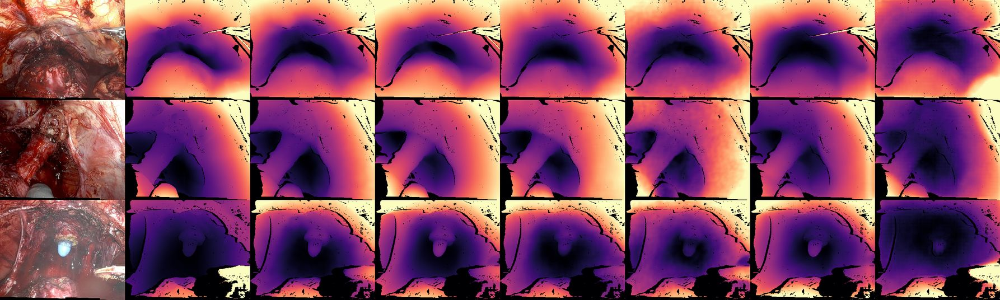

# Depth model benchmark — report

Which pretrained monocular depth model gives the best depth on our da Vinci footage, both in **shape**
(relative depth, per-frame scale free) and in **absolute millimetres** after one calibration on the ruler
set? All models are used **frozen** (no fine-tuning). Test data = the stereo proxy-GT.

## What & where
- Zero-shot shape benchmark: [scripts/zeroshot_proxy_gt.py](scripts/zeroshot_proxy_gt.py) · job [jobs/zeroshot_proxy_gt.sh](jobs/zeroshot_proxy_gt.sh) (gpu_h100, job 26733667) → `outputs/zeroshot_proxy_gt_v2/{results.json, per_frame.csv, grid.png}`
- Metric calibration benchmark: [scripts/metric_calib_proxy.py](scripts/metric_calib_proxy.py) · job [jobs/metric_calib_proxy.sh](jobs/metric_calib_proxy.sh) (gpu_h100, job 26735955) → `outputs/metric_calib_proxy/results.json`
- Zoom label detector: [scripts/zoomdet.py](scripts/zoomdet.py) + templates `data/templates/zoom/{1x,2x,4x}.npy`
- Model code on Snellius (outside the venv, one dir per model): `~/pylibs/{bench, da3, moge, unidepth, metric3d, metric3d_mmcvstub, EndoUFM}`; weights in `~/.cache/{huggingface,torch}`, `~/backbones/{EndoDAC,EndoUFM}`
- Design log with every intermediate check: [CLAUDE_NOTES.md](CLAUDE_NOTES.md) (2026-09-15 entries)

## Data
**Stereo proxy-GT (test set).** 83 rectified left-eye frames, 1340×1072 (the 5:4 content crop), from 2 patients
(18de9c5a: 53 frames, 5e27066c: 30). Depth comes from C-Fast-FoundationStereo on 5 side-by-side clips in
`~/data/3D_ProxyGT`, stored as `<stem>_depth16.png` = mm × 16 (0 = invalid, incl. GUI). Scene depth ≈ 25–105 mm.
All 5 source clips read **1× zoom** on the HUD label (30 frames checked).

**Ruler set (calibration only).** `depthclips_ruler_NoGUI`: 18 videos / 65 clips at 1340×1072. Objects of known
length in `scale_objects.json`: Ruler (annotator-typed mm), Catheter tip (5.333 mm), Robot arm (8 mm), 5 points
each. Three videos are zoomed on the HUD label for their whole length (349725a5 4×, 7d96d613 4×, 4d8eca93 2×) and
are excluded, because zoom multiplies the focal length.

| used for calibration | videos | frames | ruler | catheter | arm | total objects | true distance p5 / p50 / p95 |
|---|---:|---:|---:|---:|---:|---:|---|
| 1× videos | 15 | 1249 | 1243 | 396 | 363 | 2002 | 31.9 / 55.0 / 105.7 mm |

Annotation sources: 184 manual, 1454 optical-flow tracked, 363 measured (arm), 1 hold. No patient is in both the
ruler set and the proxy-GT, so the proxy-GT is a held-out test for the calibration.

## Methods

### Models and inference
Every model runs in its own process with its released weights and its own preprocessing. Each output is
resized bilinearly to 1072×1340 and treated as **depth up to its own units** (disparity outputs are inverted).

| model | params | input / preprocessing | raw output → depth |
|---|---|---|---|
| EndoDAC (warm start) | ViT-B + DV-LoRA | resize 392×490, RGB in [0,1] | sigmoid disparity → `disp_to_depth(20, 200)` |
| UniDepthV2 ViT-L | `lpiccinelli/unidepth-v2-vitl14` | uint8 RGB, model normalises; no camera given | metric depth (m) |
| Depth Anything V2 Large | `depth-anything/Depth-Anything-V2-Large-hf` | HF processor (518 px) | relative disparity → 1/disp |
| Depth Anything V2 Metric Indoor L | `...-Metric-Indoor-Large-hf` | HF processor | metric depth (m) |
| MoGe-2 ViT-L / MoGe ViT-L | `Ruicheng/moge-2-vitl`, `moge-vitl` | RGB in [0,1], `infer()` | depth (masked px = inf) |
| Metric3D v2 ViT-giant2 / ViT-L | torch-hub `metric3d_vit_*` | keep-ratio resize into 616×1064, pad with ImageNet mean, normalise, unpad | canonical-camera depth (focal rescale not applied; a constant, absorbed by calibration) |
| Depth Pro | `apple/DepthPro-hf` | HF processor | metric depth (m) |
| Depth Anything 3 L / Giant / Metric-L | `depth-anything/DA3-*` | `inference(process_res=504)`, no crop | depth |
| EndoUFM | GitHub checkpoint (rvlora r=4) | resize 256×320, RGB in [0,1] | disparity → `disp_to_depth(0.1, 150)` |

EndoOmni could not be tested: its repository holds only a README (no code, no weights).

### Round 1 — shape metrics (per-frame alignment)
Metrics are computed per frame on GT-valid pixels (0.001 < d < 150 mm), then averaged over the 83 frames:
- **ms** (median scaling in depth, the training metric): `d̂ = d · median(d_gt) / median(d)`.
- **ssi** (scale + shift in inverse depth): least squares `1/d_gt ≈ a·(1/d) + c` per frame, `d̂ = 1/(a/d + c)`.
  This is the fair comparison for relative-disparity models.
- Errors: abs_rel, sq_rel, RMSE (mm), RMSE-log, δ1/δ2/δ3 (share of pixels with max(d̂/d_gt, d_gt/d̂) < 1.25, 1.25², 1.25³).
- Differences vs EndoDAC use a paired bootstrap over frames (5000 resamples, 95% CI).

### Round 2 — conversion to metric depth (one calibration, frozen)
For every ruler object with 5 points `p_i = (u_i, v_i)` in full-resolution pixels, using the fixed da Vinci
intrinsics on the 1340×1072 crop (fx = 0.82·1340 = 1098.8, fy = 1.02·1072 = 1093.4, cx = 670, cy = 536):

1. Ray at unit depth: `r_i = ((u_i − cx)/fx, (v_i − cy)/fy)`.
2. In-plane length at unit depth: `R = Σ_i ‖r_{i+1} − r_i‖`.
3. True object distance: `z_true = mm / R`.
4. Model distance: `z_pred = mean_i D_model(p_i)`, bilinear sampling of the model's depth map.

In-plane (flat) length is used rather than the 3D polyline, so depth noise along a thin object cannot inflate
its length.

**Scale + shift in inverse depth (main result).** Find `s, b` minimising
`Σ ρ( log( (s / z_pred + b) · z_true ) )` over all 2002 objects, with ρ = soft-L1 (f_scale 0.1),
starting from `s = median(z_pred / z_true)` and `b = 0` (SciPy `least_squares`). If any object would get
non-positive inverse depth, fall back to scale-only.

**Scale only (comparison).** `s' = median(z_pred / z_true)`.

**Metric depth map.** Applied unchanged to every pixel of every proxy-GT frame, with no per-frame correction:

    D_mm(x) = 1 / ( s / D_model(x) + b )        (scale + shift)
    D_mm(x) = D_model(x) / s'                   (scale only)

clipped to [0.001, 150] mm, then scored against the stereo depth with the metrics above (no median scaling).

**Fitted calibrations.** Units follow each model's native output (metres for metric models, relative units for
DAv2-L, EndoDAC's 20–200 range):

| model | s | b | s' (scale only) |
|---|---:|---:|---:|
| Metric3D v2 ViT-giant2 | 0.02573 | −0.003485 | 0.02148 |
| UniDepthV2 ViT-L | 0.01139 | 0.005155 | 0.01594 |
| DAv2 Metric Indoor L | 0.01957 | 0.003333 | 0.02442 |
| Depth Anything V2 Large | 8.275e−05 | 0.007712 | 0.00015 |
| EndoDAC warm start | 1.517 | −0.01977 | 0.7232 |
| MoGe-2 ViT-L | 0.01205 | 0.005935 | 0.01835 |

For example, UniDepthV2's native "metric" depth is ~16× too far for surgery (s' = 0.016 m per mm).

**Ruler diagnostics.** Fit residual = median |z_cal/z_true − 1| per class. Distance-tracking slope = slope of
log z_cal against log z_true (1 = tracks distance, 0 = one constant distance).

## Results

### Round 1 — zero-shot shape (16 models, per-frame alignment)
Sorted by ssi abs_rel. Δ = ssi abs_rel − EndoDAC's, with a 95% bootstrap CI.

| model | ms abs_rel | ssi abs_rel | ssi δ1 | Δ vs EndoDAC [95% CI] | per patient ssi (18de9c5a / 5e27066c) |
|---|---:|---:|---:|---|---|
| **UniDepthV2 ViT-L** | **0.1187** | **0.0991** | **0.906** | −0.054 [−0.063, −0.044] | 0.106 / 0.087 |
| Depth Anything V2 Large | 0.2998 | 0.1059 | 0.889 | −0.047 [−0.057, −0.037] | 0.119 / 0.082 |
| MoGe-2 ViT-L | 0.1638 | 0.1120 | 0.881 | −0.041 [−0.050, −0.032] | 0.122 / 0.095 |
| MoGe ViT-L | 0.1413 | 0.1148 | 0.880 | −0.038 [−0.049, −0.027] | 0.122 / 0.103 |
| Metric3D v2 ViT-giant2 | 0.1275 | 0.1174 | 0.878 | −0.035 [−0.045, −0.025] | 0.123 / 0.107 |
| DAv2 Metric Indoor L | 0.1306 | 0.1181 | 0.854 | −0.035 [−0.043, −0.026] | 0.127 / 0.103 |
| DA3 Metric-Large | 0.1673 | 0.1335 | 0.825 | −0.019 [−0.029, −0.009] | 0.137 / 0.127 |
| EndoUFM | 0.1516 | 0.1403 | 0.789 | −0.012 [−0.017, −0.008] | 0.146 / 0.130 |
| Depth Pro | 0.1606 | 0.1459 | 0.786 | −0.007 [−0.021, +0.008] | 0.160 / 0.121 |
| DA3 Giant | 0.1937 | 0.1500 | 0.769 | −0.003 [−0.014, +0.009] | 0.170 / 0.115 |
| EndoDAC fine-tuned (manual, ep5) | 0.1649 | 0.1519 | 0.765 | −0.001 | 0.155 / 0.147 |
| EndoDAC fine-tuned (sharpest 1×, ep5) | 0.1653 | 0.1525 | 0.763 | −0.000 | 0.155 / 0.147 |
| EndoDAC warm start | 0.1660 | 0.1527 | 0.762 | — | 0.156 / 0.147 |
| EndoDAC fine-tuned (ruler sw05) | 0.1666 | 0.1536 | 0.761 | +0.001 | 0.156 / 0.149 |
| Metric3D v2 ViT-L | 0.1705 | 0.1548 | 0.763 | +0.002 [−0.010, +0.015] | 0.168 / 0.131 |
| DA3 Large | 0.1861 | 0.1585 | 0.742 | +0.006 [−0.006, +0.018] | 0.176 / 0.128 |

DAv2-L's ms value is meaningless: median scaling cannot remove the shift in its disparity output.
UniDepthV2 is first on 11 of the 14 metrics (7 × {ms, ssi}). The three it loses are near-ties: ms RMSE
(Metric3D-g2 6.65 vs 6.81 mm), ssi δ2, and δ3.


*Columns: RGB · stereo GT · UniDepthV2 · DAv2-L · MoGe-2 · Metric3D-g2 · DAv2 Metric Indoor · EndoDAC warm start.*

### Round 2 — absolute mm after one ruler calibration (6 models)
Proxy-GT scored with no per-frame scaling. Δ = abs_rel − EndoDAC's (scale + shift), with a 95% bootstrap CI.

| model | abs_rel | RMSE | δ1 | scale-only abs_rel | Δ vs EndoDAC [95% CI] | shape rank (Round 1) |
|---|---:|---:|---:|---:|---|---:|
| **Metric3D v2 ViT-giant2** | **0.189** | **10.1 mm** | **0.679** | 0.191 | −0.263 [−0.302, −0.223] | 5 |
| UniDepthV2 ViT-L | 0.218 | 11.2 mm | 0.633 | 0.222 | −0.234 [−0.277, −0.192] | 1 |
| DAv2 Metric Indoor L | 0.278 | 12.8 mm | 0.549 | 0.265 | −0.174 [−0.217, −0.131] | 6 |
| Depth Anything V2 Large | 0.300 | 15.5 mm | 0.452 | 0.405 | −0.152 [−0.173, −0.130] | 2 |
| EndoDAC warm start | 0.452 | 22.2 mm | 0.309 | 0.403 | — | 13 |
| MoGe-2 ViT-L | 0.528 | 20.7 mm | 0.301 | 0.580 | +0.076 [+0.039, +0.114] | 3 |

**Metric3D-g2 vs UniDepthV2 (paired):** abs_rel −0.029 [−0.054, −0.006], RMSE −1.14 mm [−2.02, −0.31],
δ1 +0.045 [−0.007, +0.099] (not significant). Metric3D-g2 is better on 47 of 83 frames. Per patient abs_rel:
Metric3D-g2 0.189 / 0.189, UniDepthV2 0.227 / 0.202.

**Ruler calibration fit and distance tracking** (on the 2002 calibration objects):

| model | fit residual all | ruler | catheter | arm | tracking slope (s+b) | slope (scale only) |
|---|---:|---:|---:|---:|---:|---:|
| Metric3D v2 ViT-giant2 | **0.136** | **0.124** | 0.148 | 0.182 | 0.61 | 0.50 |
| UniDepthV2 ViT-L | 0.184 | 0.187 | 0.194 | 0.155 | 0.28 | 0.41 |
| DAv2 Metric Indoor L | 0.178 | 0.177 | 0.158 | 0.218 | 0.51 | 0.65 |
| Depth Anything V2 Large | 0.167 | 0.160 | 0.174 | 0.187 | 0.54 | 1.14 |
| EndoDAC warm start | 0.189 | 0.191 | 0.233 | **0.145** | 0.36 | 0.17 |
| MoGe-2 ViT-L | 0.193 | 0.179 | 0.277 | 0.175 | 0.29 | 0.44 |

## Findings
- **Shape:** UniDepthV2 is the best frozen model, 35% lower ssi error than EndoDAC and better on both patients.
  Five more general models beat EndoDAC by 23–31%. None of our EndoDAC fine-tunes moves shape by more than 1%.
- **Absolute:** the ranking changes once scale counts. Metric3D-g2 (5th on shape) is best in mm, UniDepthV2 a
  close second; both have less than half EndoDAC's absolute error. MoGe-2 (3rd on shape) falls below EndoDAC:
  its depth level jumps between scenes, so a frozen calibration misplaces the proxy frames.
- **Metric models barely need the shift:** scale-only is within 0.004 abs_rel for Metric3D-g2 and UniDepthV2,
  so one multiplier calibrates them. The relative DAv2-L needs the shift (0.405 → 0.300). EndoDAC's negative
  shift hurts it (scale-only 0.403 < 0.452).
- **Calibrating once costs roughly 2× error** vs per-frame alignment for every model (UniDepthV2 ssi 0.099 →
  absolute 0.218). That gap is frame-to-frame scale drift plus the difference between ruler and proxy scenes.

## Caveats
- The test set is 83 frames from 2 patients. Bootstrap CIs treat frames as independent, so they are optimistic.
- Fixed intrinsics (0.82 / 1.02) for every model. In-plane length underestimates tilted objects (cos θ), which
  biases z_true high and flattens the tracking slope. Read the slopes as coarse.
- 73% of calibration objects are optical-flow tracked, not hand-placed.
- Metric3D is used in its canonical camera (no focal rescale). This is a constant factor absorbed by s/s', so
  its native, uncalibrated metric accuracy is not tested here.
- Checked, not a bug: Metric3D ViT-L's checkerboard artefacts (weights load fully; only the pretraining-only
  `mask_token` is missing). DA3's sky clamp never fires (no sky head; patching it out changed nothing).

## Reproduce
```bash
ssh snellius 'cd ~/RARPai && sbatch jobs/zeroshot_proxy_gt.sh --out outputs/zeroshot_proxy_gt_v2'
ssh snellius 'cd ~/RARPai && sbatch jobs/metric_calib_proxy.sh --exclude-videos 349725a5,4d8eca93,7d96d613'
```
