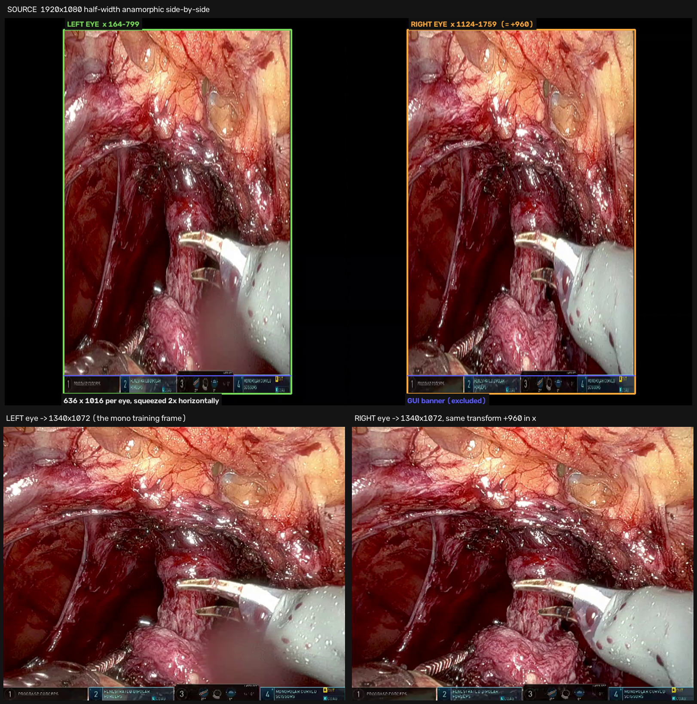
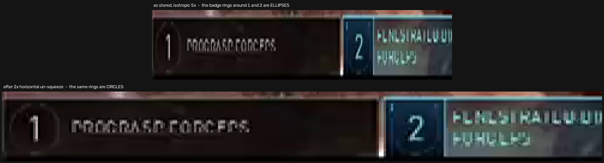
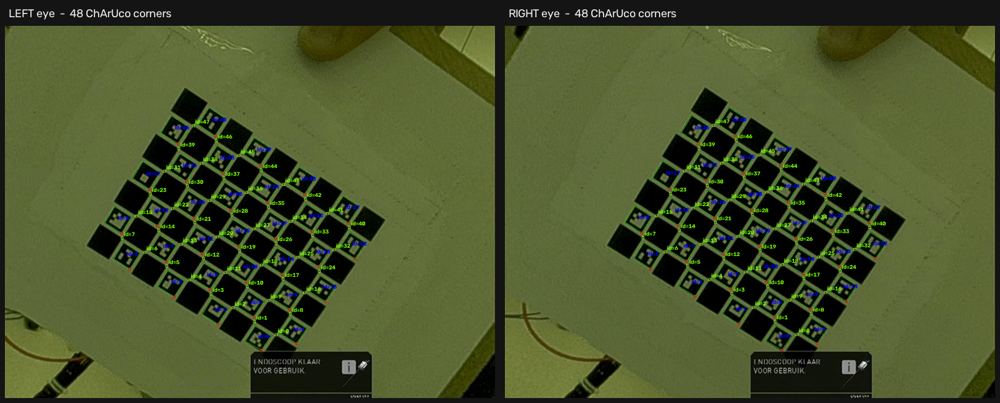
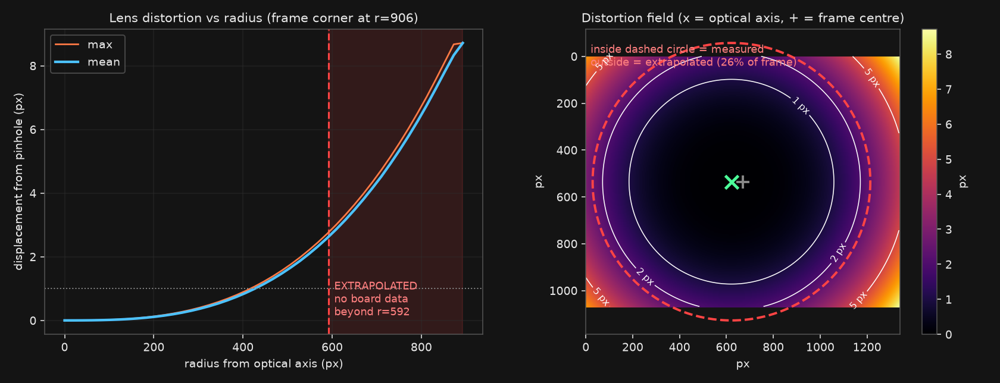
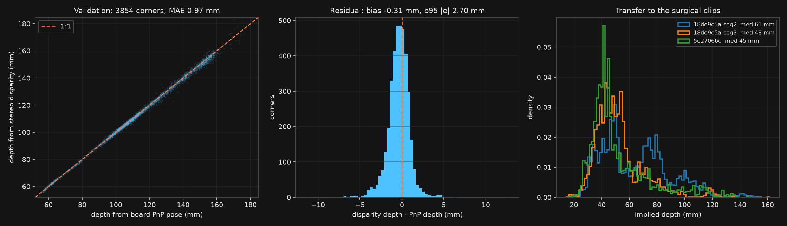
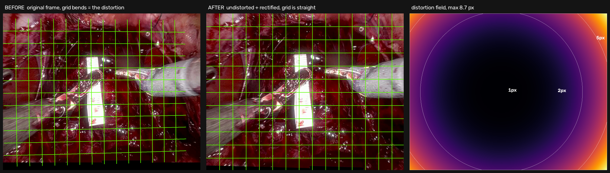

# da Vinci 3D stereo — geometry, calibration, and metric depth

Findings from decoding the 3D (side-by-side) console recordings in `../data/3D_ProxyGT` and
stereo-calibrating them from the ChArUco clip in `../data/ARUCO_calibration`. The goal is a
**metric proxy ground truth** for monocular depth training.

Every number below was measured on the actual files. Where something is still an assumption it
is marked **ASSUMPTION**; where a number is unsupported by data it is marked **EXTRAPOLATED**.

- Calibration: [scripts/calibrate_stereo_charuco.py](scripts/calibrate_stereo_charuco.py) → `outputs/stereo_calib/calib.json`
- Rectification: [scripts/rectify_mono_clips.py](scripts/rectify_mono_clips.py)
- Figures: [scripts/stereo_report_figs.py](scripts/stereo_report_figs.py) → `docs/stereo/`
- Design log: [CLAUDE_NOTES.md](CLAUDE_NOTES.md), 2026-09-09

---

## 1. What the 3D files actually are

| property | value |
|---|---|
| Container | 1920×1080, 59.94 fps, H.264 |
| Layout | **Half-width anamorphic side-by-side** (not frame-sequential) |
| Left eye | x `164..799`, y `32..1047` → 636×1016 |
| Right eye | x `1124..1759` (exactly +960), same rows |
| Per-eye native | 1272×1016 after a **2× horizontal** stretch |
| GUI banner | rows `965..1015` inside the eye crop |



*Figure 1 — Where the two eyes sit in the source frame (top) and where they land in the
1340×1072 training frame (bottom). The two eyes are exactly 960 px apart; the red line marks
the GUI banner, which is excluded.*

### Why the squeeze is exactly 2×, not "about 2×"



*Figure 2 — The da Vinci instrument badges are drawn as circles by the console. As stored they
fit an ellipse of ratio ≈2:1. The same circle is overlaid on both panels; it only fits once the
width has been restored. Radius is half the badge's height, which the horizontal squeeze cannot
affect.*

The second, independent confirmation is the calibration itself: **fx/fy = 1.0000** (§3). Had the
un-squeeze been wrong, the calibrated pixels would not have come out square.

### The encoder's transform

Cross-correlating the GUI banner — a fixed-size overlay rendered at native console resolution,
i.e. a free ruler — between the SBS halves and the raw 2D videos gives:

```
scale 2.125,  left edge x = 286
```

identical on **all three surgical clips, both eyes, and the calibration clip** (NCC ≈ 0.72).
So the SBS encoder took the whole console frame, scaled it uniformly by 0.94, then squeezed it
2× horizontally into each 960-wide half:

```
raw_x = 286 + 2.125 · eye_x
raw_y =   0 + 1.063 · eye_y
```

Sanity check: the banner starts at eye row 965; 965 × 1.063 = 1025.8, and the banner in the 2D
videos starts at row 1024.

---

## 2. Mapping onto the existing 1340×1072 pipeline

From `source_crop.json` in the processed depth clips, the mono crop is:

```
1920×1080  →  x=289, y=4, w=1340, h=1072
```

Measuring the raw 2D videos: anatomy occupies rows `0..1023`, the banner rows `1024..1079`,
content columns `~285..1631`. **So the 1340×1072 frame is 1020 rows of anatomy plus 52 rows of
GUI banner** (rows 1020–1071), blacked out in the NoGUI clips. It is not 1072 rows of anatomy.

Composing the two maps gives one sub-pixel crop-and-resize per eye, straight into the training
frame:

| | |
|---|---|
| Left eye source | `x ∈ [165.41, 796.00), y ∈ [35.76, 1044.23)` in the 1920×1080 frame |
| Right eye source | same, `+960` in x |
| Resize to | **1340×1072** |
| Banner rows | 1020–1071, excluded |

Implemented as `eye_to_mono()` in `calibrate_stereo_charuco.py`. **Do not re-derive it.**

> **Why an error in the 2.125 would not matter.** Any error in the affine is absorbed into fx/fy
> during calibration. Only *consistency* between the calibration clip and the surgical clips
> matters — and the banner correlation is bit-identical across all four files.

---

## 3. Stereo calibration

ChArUco boards from `OTHERS/charuco_endoscope_A4.pdf`:

| board | dictionary | ids | squares | square | marker | purpose |
|---|---|---|---|---|---|---|
| A (main) | `DICT_4X4_50` | 0–30 | 9×7 | 8.00 mm | 6.00 mm | 80–200 mm working distance |
| B (close) | `DICT_4X4_50` | 31–47 | 7×5 | 6.00 mm | 4.50 mm | 40–100 mm, and image corners |



*Figure 3 — Detection in both eyes, full 48 ChArUco corners on board A. Markers from both
boards are visible (ids up to 47); the id ranges do not overlap, so both boards can be in frame
at once.*

120 sharpness-selected views across both boards, 3697 corner pairs, RMS reprojection **0.51 px**.

### Results (left eye, in the 1340×1072 frame)

```
fx 1064.12   fy 1064.16   cx 615.35   cy 536.85     px
fx/fy = 1.0000
baseline           4.1197 mm
stereo rotation    0.162°
console convergence (cxL − cxR)   −96.00 px
cyL − cyR                          ~0 px
rectified:   Z_mm = 4719.6 / disparity_px
```

`cyL − cyR ≈ 0` and a stereo rotation of 0.162° confirm the console ships an **already-rectified**
pair. The −96 px is a deliberate horizontal convergence shift for comfortable 3D viewing — which
is why raw disparities come out both positive and negative with a median near zero.

### Robustness of the intrinsics

Three independent calibration configurations. The core parameters move by well under 1%:

| | free k3, board A | k3 fixed, board A | **k3 fixed, boards A+B** |
|---|---|---|---|
| fx (px) | 1061.78 | 1062.35 | **1064.12** |
| cx (px) | 608.65 | 608.79 | **615.35** |
| baseline (mm) | 4.1155 | 4.1201 | **4.1197** |
| convergence (px) | −96.73 | −95.89 | **−96.00** |
| validation MAE (mm) | 1.004 | 1.283 | **0.889** |

The last column is what `calib.json` now holds. Everything in §4 and §6 rests on parameters that
are stable across all three; §5 does not, and that is the point of §5.

---

## 4. Comparison with the SCARED / da Vinci Xi standard

Normalised the way the training code writes K (fx/W, fy/H, cx/W, cy/H):

| | fx | fy | cx | cy |
|---|---|---|---|---|
| **Ours (measured)** | 0.7941 | 0.9927 | **0.4592** | 0.5008 |
| SCARED / da Vinci Xi | 0.8200 | 1.0200 | 0.5000 | 0.5000 |
| ratio | 0.968 | 0.973 | **0.918** | 1.002 |

**The focal length was a good stand-in; the principal point was not.**

- fx, fy agree to ~3%. Borrowing SCARED's focal was defensible.
- **cx is off by 55 px (8%).** The optical axis is not at frame centre. This biases ray
  directions by up to ~3° across the frame, systematically rather than randomly, so it does not
  average out. Every prior UMC depth run reprojected through this error.
- cy is correct to 0.1%, which argues the horizontal offset is a real property of how the console
  crops rather than fit noise. It also held across all three calibration configurations.

The ~3% focal error is also a ~3% depth-scale error, directly relevant to the metric scale work —
some of the observed scale drift may simply be this.

---

## 5. Lens distortion — real, but only measured over 74% of the frame



*Figure 4 — Left: distortion vs radius, with the region beyond the board's reach shaded. Right:
the 2D field; inside the dashed circle is measured, outside is extrapolated. Note the field is
not centred on the frame — that is the cx finding of §4 made visible.*

Pixel displacement from a pure pinhole model, left eye:

| radius from optical axis | mean | max | corner pairs observed |
|---|---|---|---|
| 0–200 px | 0.08 px | 0.31 px | 1881 |
| 200–400 px | 0.49 px | 1.70 px | 1699 |
| 400–600 px | 1.76 px | 5.12 px | **117** |
| 600–900 px | *6.27 px* | *18.12 px* | **0 — EXTRAPOLATED** |

**The board never went past r = 592 px. The frame corner is at r = 906. So 26% of the frame,
including all four corners, is unconstrained by any observation.** Different but equally
well-fitting distortion models disagree badly out there — 5.4 px (free k3), 15.1 px (k3 fixed,
board A) and 6.3 px (k3 fixed, A+B) mean displacement in the 600–900 band, a 3× spread — while
agreeing to a few tenths of a pixel inside r = 400.

What survives this caveat, and what does not:

- **Survives:** distortion is real and material in the measured zone. Skipping undistortion cost
  a **9% depth bias** in validation; undistorting brought it to 0.8%. Every board corner in that
  test sits inside r = 592, so it is a measured result, not an extrapolated one.
- **Does not survive:** any specific claim about how large the distortion is at the frame edges
  or corners. An earlier draft of this report quoted 5.37 px mean at r 600–900 as a finding; that
  number is a model artefact, not a measurement.

**Practical consequence.** Correcting the mono clips with this calibration would apply a large,
unverified correction exactly where the correction is biggest. That is not obviously better than
leaving it alone. The fix is a re-recording, not more processing — see §8.

---

## 6. Validation

Depth from stereo disparity versus depth from the board's own PnP pose. These are independent
chains — PnP uses one eye plus the known 8 mm board geometry; disparity uses both eyes plus the
baseline. If the rectification, the eye→mono affine, or the board spec were wrong, they would not
agree.



*Figure 6 — Left: disparity depth vs PnP depth against the 1:1 line. Centre: residuals.
Right: implied depth distributions on the three surgical clips, from SIFT correspondences.*

```
3697 corners, Z 44–203 mm
MAE 0.889 mm    bias −0.212 mm    p95 2.450 mm    rel MAE 0.82%
epipolar |dy| after rectification: median 0.201 px, p95 0.657 px
```

This check runs automatically inside `calibrate_stereo_charuco.py` and exits non-zero above
3 mm MAE.

### Transfer to the surgical clips

| clip | epipolar &#124;dy&#124; med | disparity p5 / med / p95 | implied **Z_mm** p5 / med / p95 |
|---|---|---|---|
| `18de9c5a…seg2` | 0.83 px | 44 / 77 / 146 | 32 / 61 / 107 |
| `18de9c5a…seg3` | 0.64 px | 56 / 97 / 147 | 32 / 48 / 84 |
| `5e27066c` | 1.30 px | 45 / 106 / 161 | 29 / 45 / 105 |

All three land in the endoscopic working range, **including `5e27066c`, which is a different
session from the calibration clip**. Independently, the pre-flight estimate from the
hand-annotated ruler / catheter / robot-arm objects gave median 55 / 61 / 45 mm. Two unrelated
measurement chains agreeing on working distance is a strong end-to-end check.

All four clips (calibration and all three surgical) display **1× 0°** in the console banner —
same digital zoom, same scope angle. This is what licenses transferring the calibration.

---

## 7. Rectification of the mono clips



*Figure 5 — The green grid is drawn straight in the rectified frame and mapped back onto the
original, so the bend on the left is the distortion itself. Right panel: the distortion field
for this frame.*

`scripts/rectify_mono_clips.py` builds the maps, remaps images and masks, and transforms the
`scale_objects.json` annotation points with the same transform. **It has not been run on the
dataset** — see §8 for the two blockers.

---

## 8. Open assumptions and risks

### Blocker 1 — the calibration does not cover the periphery

**26% of the frame, including all four corners, has no board data.** Board B exists for
"pushing the target into the image corners" per its own datasheet, but in this recording it only
reached r = 664 on its own; combined, the calibration set tops out at r = 592.

**Fix: re-record the calibration** with the board deliberately pushed into all four corners and
held at several depths. That is a few minutes of recording and removes the largest remaining
uncertainty. Everything else in this report stays valid; the intrinsics would barely move (§3)
and only §5 would change.

### Blocker 2 — which eye is the 2D feed?

**ASSUMPTION.** The mono training videos are 2D console output. The calibration gives two
different principal points (left cx 615, right cx 711 — the 96 px convergence shift).
Undistorting the mono clips requires knowing which applies. The mono videos come from 18
surgeries with **no overlap** with the two stereo surgeries, on Snellius either, so correlation
cannot settle it. Three attempts failed: cross-surgery correlation (no shared surgeries), fitting
the endoscope image circle (the console crops inside it, no arc to fit), and content/banner
extents (identical for both eyes).

Using the wrong eye is not neutral — at the periphery it is *worse than no correction at all*:

| radius | error if uncorrected | residual if wrong eye used |
|---|---|---|
| 0–200 px | 0.16 px | 0.17 px |
| 200–400 px | 0.79 px | 0.36 px |
| 400–600 px | 2.41 px | 2.46 px |
| **600–900 px** | **5.36 px** | **11.59 px** |

Cheapest fixes: ask whoever operates the da Vinci which eye the 2D channel carries; or record the
ChArUco board once through the 2D output and calibrate it directly. The second removes the
assumption rather than confirming it, and combines naturally with the re-recording above.

### Other risks

**ASSUMPTION — calibration transfers across sessions.** Calibration comes from one session
(`18de9c5a`). The `1× 0°` readout matches everywhere checked and the baseline is fixed hardware,
so the focal is the main risk. The `5e27066c` transfer check (§6) is reassuring, not proof.

**RESOLVED — the board print scale.** All metric scale traces back to the 8.00 mm square pitch,
so a mis-scaled print would scale every depth here with it. Nick manually measured the printed
board against the PDF's "must be exactly 100.0 mm" bar and confirmed **100%** (2026-09-09).
The metric chain therefore has no unverified scale factor left in it.

**Rectification crops FOV.** `stereoRectify(alpha=0)` raises the effective focal from 1064 to
1222 px, zooming in to discard invalid border. Annotation points near the frame edge fall outside
and would be dropped — a point at (1240, 980) maps to (1376, 1058), off-frame. With only 1677
annotated frames carrying the metric scale signal, count the losses before choosing `alpha`.

---

## 9. Consequences for the proxy-GT plan

**The proxy GT can be metric.** `Z_mm = 4719.6 / disparity_px` on the rectified pair, validated
to 0.9 mm. This replaces the scale-and-shift-invariant loss that would otherwise be required, and
gives a dense alternative to the 1677 sparse hand-annotated segments currently carrying the
metric scale signal.

**Rectified disparity search range is ~30–200 px** — measured on the surgical clips, not guessed.

**Precision ceiling.** Each eye is horizontally subsampled 2× by the SBS encoder, so disparity
precision in native pixels is roughly half that of a true full-resolution stereo pair. Adequate
for surfaces, poor on thin structures (suture, instrument tips).

**Sampling.** At 59.94 fps consecutive frames are near-duplicates; ~10 fps (every 6th frame) is
the useful rate.

**Matcher.** Zero-shot foundation stereo (FoundationStereo, DEFOM-Stereo) is the recommended
generator: public weights, rectified-pair input, and a monocular prior that carries through
textureless blood-covered tissue where cost-volume matching has nothing to lock onto. Caveat
worth stating in a write-up: that monocular prior means the proxy GT is *partly* a monocular
prediction, so supervise only where stereo actually agreed (left-right consistency plus a
specular mask) rather than on the raw output.

---

## 10. Method notes for writing up

- The SBS layout, the 2.125 scale, and the banner-as-ruler trick are all **measurements**, with
  `fx/fy = 1.0000` as the independent cross-check (Figures 1–2).
- The validation (§6) is a genuine independent check: PnP and disparity share no parameters
  except the board geometry.
- The 9%-bias-from-skipping-undistortion result (§5) quantifies an assumption that endoscopic
  depth papers commonly leave implicit.
- **The calibration-coverage result (§5, Figure 4) is worth reporting in its own right.** A
  calibration can have excellent RMS (0.51 px here) and a convincing validation (0.9 mm) while
  being entirely unconstrained over a quarter of the image. RMS is computed only where the target
  was. This is an easy failure to ship silently.
